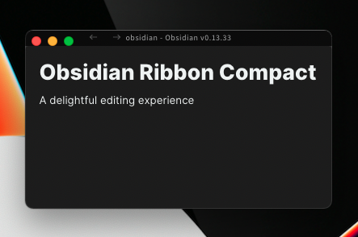

# Obsidian Ribbon Compact

This pluggin hides all of Obsidian's ribbons and just shows the editor itself.


## Commands
Use the command pallete to toggle the view, it will sync to your editors settings.
```sh
Toggle Compact
```